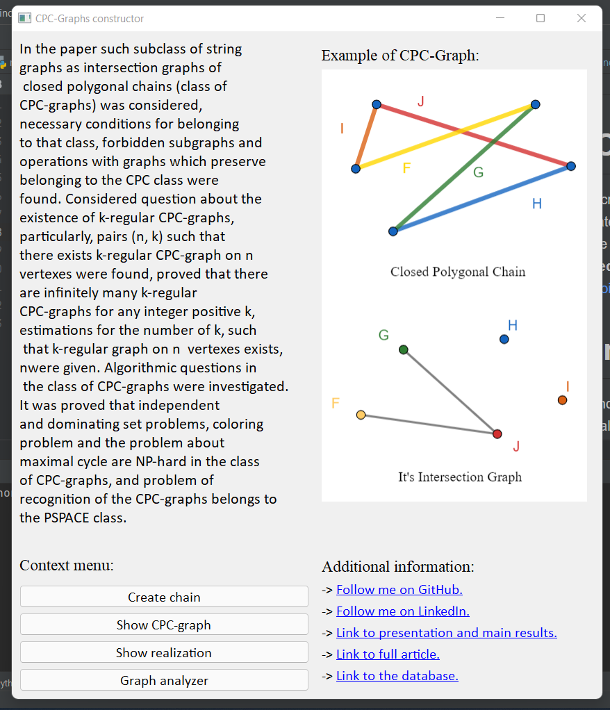

# CPC Graph Constructor
Tool for creating polygonal chains (by hands or by set of coordinates) and generating their CPC-graphs. 
Was used to complete and check results of the paper **Graphs of Intersection of Closed Polygonal Chains**, DOI: https://doi.org/10.33581/2520-6508-2021-1-54-68.

## Main functions
Main window provides functions for creating and analyzing polygonal chains.

**Create Chain** button creates a window where user can create his own polygonal chain for 
future investigations. 

**Show realization** allows you to view your chain and save it as a *.jpeg* file in which the 
corresponding graph is encoded. This CPC-grap and it's realization will be uploaded to a 
Database of CPC-graphs.

## Graph analysis

This part of the application performs the function of recognizing CPC-graphs. 
The problem of recognizing the CPC-graph is an NP-hard problem, and to simplify 
the task, the graph entered by the user is checked for a number of necessary 
properties of the CLC of the graph: 
-- hamiltonian cycle in complement graph, 
-- upper bounds for number of segments,
-- forbidden subgraphs,
-- properties for path, cycle or regular graphs,
-- searching appropriate graph in the Database.

One can upload graph from *.json*, *.txt* files or paste it's description in 
text editor. After analysis there will appear a result of information properties.

